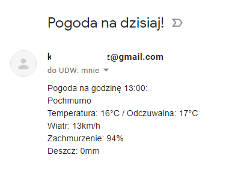

# ForecastProject

Since I started to ride on bicycle to work, I needed to check the weather every day. I decided to build an app that will download the forecast from website and send me it to my email adress in formatted string. There is also an option to send SMS instead of email.

App checks when I start and finish my work (from Google Calendar), downloads data from forecast website (https://pogoda.interia.pl), turn it into formatted string and send me two emails: with forecast for one hour before my shift and with forecast for hour when I finish my shift.

