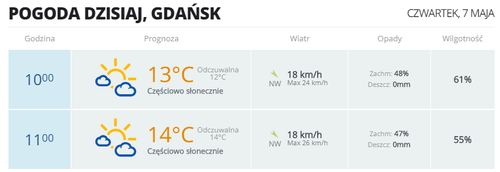

# ForecastProject

Since I started to ride on bicycle to work, I needed to check the weather every day. I decided to build an app that will download the forecast from website and send me it to my email adress in formatted string. 

App checks if I work today -> if yes, it checks the hour when I start work and send me two emails: with forecast for one hour before my shift and with forecast for hour when I finish my shift.

